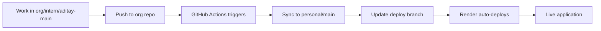

# Render Deployment Guide

This guide walks you through deploying your NestJS application to Render with automatic syncing from your organization repository.

## Prerequisites

✅ Dual repository setup completed (see `DUAL_REPO_SETUP.md`)
✅ `deploy` branch created in your personal repository
✅ Health check endpoints added to your application

## Step 1: Create Render Account

1. Go to [render.com](https://render.com)
2. Sign up with your GitHub account
3. Connect your GitHub account to Render

## Step 2: Create PostgreSQL Database

1. **In Render Dashboard**:
   - Click "New +" → "PostgreSQL"
   - Name: `schedula-db`
   - Database Name: `schedula`
   - User: `schedula_user`
   - Region: Choose closest to your users
   - Plan: Free (for development)

2. **Save Database Credentials**:
   - After creation, note down the connection details
   - You'll need these for the web service

## Step 3: Create Web Service

1. **In Render Dashboard**:
   - Click "New +" → "Web Service"
   - Connect Repository: `Aditay7/Nest-Js-Project`
   - Branch: `deploy` (important!)
   - Name: `schedula-backend`
   - Region: Same as database
   - Plan: Free

2. **Build & Deploy Settings**:
   ```
   Build Command: npm install
   Start Command: npm run start:prod
   ```

3. **Environment Variables**:
   ```
   NODE_ENV=production
   PORT=10000
   
   # Database (from your PostgreSQL service)
   DATABASE_HOST=<your-db-host>
   DATABASE_PORT=5432
   DATABASE_USERNAME=schedula_user
   DATABASE_PASSWORD=<your-db-password>
   DATABASE_NAME=schedula
   
   # JWT Configuration
   JWT_SECRET=<generate-a-secure-secret>
   JWT_EXPIRES_IN=24h
   
   # Optional: For better logging
   LOG_LEVEL=info
   ```

4. **Advanced Settings**:
   - Health Check Path: `/health/simple`
   - Auto-Deploy: Yes

## Step 4: Configure Auto-Deployment

### Option A: Using GitHub Actions (Recommended)

The GitHub Actions workflow is already set up in `.github/workflows/sync-and-deploy.yml`.

1. **Add Secrets to Personal Repository**:
   - Go to your personal repo: `Aditay7/Nest-Js-Project`
   - Settings → Secrets and variables → Actions
   - Add these secrets:

   ```
   PERSONAL_REPO_TOKEN: <your-github-personal-access-token>
   RENDER_DEPLOY_HOOK: <your-render-deploy-hook-url>
   ```

2. **Get Render Deploy Hook**:
   - In Render service → Settings → Deploy Hook
   - Copy the URL (looks like: `https://api.render.com/deploy/srv-xxx?key=xxx`)

3. **Test Auto-Deployment**:
   - Make a change in org repo (`intern/aditay-main`)
   - Push to org repo
   - GitHub Actions should automatically sync and deploy

### Option B: Manual Deployment

If you prefer manual control:

```bash
# Sync repositories
.\scripts\sync-repos.ps1 o2p

# Update deployment branch
.\scripts\sync-repos.ps1 deploy

# Trigger deployment (if you have the hook)
curl -X POST "YOUR_RENDER_DEPLOY_HOOK_URL"
```

## Step 5: Verify Deployment

1. **Check Service Status**:
   - In Render dashboard, verify service is "Live"
   - Check logs for any errors

2. **Test Health Endpoints**:
   ```bash
   # Simple health check
   curl https://your-app.onrender.com/health/simple
   
   # Detailed health check
   curl https://your-app.onrender.com/health
   ```

3. **Test API Endpoints**:
   ```bash
   # Test user registration
   curl -X POST https://your-app.onrender.com/user/register \
     -H "Content-Type: application/json" \
     -d '{"name":"Test User","email":"test@example.com","password":"password123"}'
   ```

## Step 6: Database Migration

If you have database migrations:

1. **Run Migrations** (one-time setup):
   - In Render service → Shell
   - Run: `npm run migration:run`

2. **Or set up auto-migration** in your app:
   ```typescript
   // In your database config
   synchronize: process.env.NODE_ENV !== 'production', // false for production
   migrationsRun: true, // Run migrations automatically
   ```

## Monitoring & Maintenance

### Logs
- **Render Logs**: Available in service dashboard
- **Application Logs**: Use structured logging in your app

### Performance
- **Free Tier Limitations**:
  - Service sleeps after 15 minutes of inactivity
  - 750 hours/month limit
  - 512MB RAM, 0.1 CPU

### Scaling
When ready to scale:
- Upgrade to paid plan for better performance
- Add Redis for caching
- Set up monitoring with tools like Sentry

## Troubleshooting

### Common Issues

1. **Build Failures**:
   ```bash
   # Check if all dependencies are in package.json
   npm install
   npm run build
   ```

2. **Database Connection Issues**:
   - Verify environment variables
   - Check database is in same region
   - Ensure database allows connections

3. **Health Check Failures**:
   - Install terminus: `npm install @nestjs/terminus`
   - Verify health endpoint returns 200 status

4. **Sync Issues**:
   ```bash
   # Check repository status
   .\scripts\sync-repos.ps1 status
   
   # Force sync if needed
   .\scripts\sync-repos.ps1 deploy
   ```

### Debug Commands

```bash
# Check current deployment branch
git branch -a | grep deploy

# Verify remote repositories
git remote -v

# Check last deployment
git log --oneline -5

# Test local build
npm run build
npm run start:prod
```

## Security Checklist

- [ ] Environment variables set (no hardcoded secrets)
- [ ] Database credentials secure
- [ ] JWT secret is strong and unique
- [ ] CORS configured properly
- [ ] Rate limiting enabled (if applicable)
- [ ] Input validation in place

## Workflow Summary



Your application is now set up for automatic deployment! Every time you push to the organization repository, your personal repository and Render deployment will be automatically updated.

## Next Steps

1. **Set up monitoring** with health checks
2. **Configure custom domain** (paid plans)
3. **Add CI/CD tests** before deployment
4. **Set up staging environment** for testing
5. **Configure backup strategy** for database
